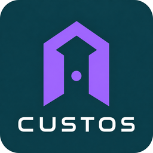

# benni_door_policy

Türschloss-Policy (Aqara Smart Lock U200) als eigenständige HACS-Custom-Integration — L2 im benni_* Home-Assistant-Fleet.

**Status:** v0.2.6 — Presence-Arbitration kommt aus `benni_core_state`; Pure-Logic-Tests vorhanden. Auto-Unlock nur bei echter Heimkehr (`raw_presence != zuhause`).
**Lastenheft:** `einhornzentrale/docs/lastenhefte/reviewed/tuerschloss/` (führend).

## Kernformel
> Weggehen verriegelt. Heimkommen entriegelt. Öffnen bleibt immer bewusst manuell.

## Was es tut
- **Auto-Lock (R-01):** `effective_presence` `away`/`leaving`, `raw_presence=abwesend` **und** Schloss `entriegelt` → verriegeln (60 s Stabilisierung).
- **Auto-Unlock (R-02):** `effective_presence=home` oder `arriving` mit hoher Confidence, `raw_presence != zuhause` (echte Heimkehr) **und** Schloss `verriegelt` → entriegeln (5 s Stabilisierung). Tür bleibt zu.
- **Anti-Flap:** schnelle Lock/Unlock-Gegenaktionen, wiederholte Unlocks und frische Roh-Schlosszustandswechsel werden geblockt.
- **Combined-Sensor** (`verriegelt` / `entriegelt` / `unbekannt` / `nicht_erreichbar`) mit Attributen (Batterie, Szenario-Flags, Heimband, Anwesenheit).
- **Resync** nach HA-Start + periodisch (R-07).

## Sicherheit (absolut)
- **R-06:** ruft ausschließlich `lock.lock` / `lock.unlock` — **niemals** `lock.open` oder eine aequivalente Falle-ziehen-Aktion.
- **R-05:** keine automatische Verriegelung bei Anwesenheit (Fluchtweg).
- **R-04:** bei `unbekannt`/`nicht_erreichbar` keine Aktion.
- **Shadow-safe:** `apply_enabled` defaultet auf False — schaltet erst nach bewusster Aktivierung.

## Konsumierte Quellen (als Entity-IDs aus dem Config-Flow)
- Schloss: `lock.aqara_smart_lock_u200`
- Effective Presence: `sensor.system_benni_core_state_presence_effective`
- Batterie (optional): Entity oder Attribut `battery_level` am Schloss

`raw_presence` wird als Attribut der Effective-Presence-Entity gelesen; `bei_eltern` und `zuhause` blockieren Auto-Lock.

Kein Python-Cross-Modul-Import — strikt Entity-IDs.

## Tests
```
../benni-core-state/.venv/Scripts/python.exe -m pytest tests/door_policy/test_policy.py -q
```


## Unicorn Station branding

**CUSTOS** is the product brand. See [asset provenance and HA display conventions](brand/README.md). Technical identities and behavior remain unchanged.
